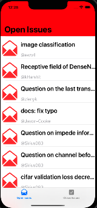
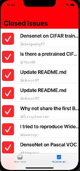
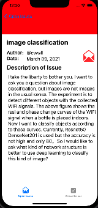

# Assignment 2

* Name:             Hengkuan Lu
* UChicago Email:   hklu21@uchicago.edu
* Slack Username:   Hengkuan Lu

## Introduction

This is an app to fetch github issues (both open and closed ones). You can set the sepcific github repository that you are interested in in the "GithubClient.swift" with the form

```
https://api.github.com/repos/<OWNER>/<REPO>/issues?state=<STATE>
```

Run the app and srcoll the screen to show different issues, and click the button on the bottom to swith between open issues and closed issue. Click one specific issue to detail information of this issue and one can get back to view another issue.

## samples

     


## Resources and Attributions
[Date Format in Swift](https://stackoverflow.com/questions/35700281/date-format-in-swift)

[Print optional string](https://www.reddit.com/r/swift/comments/4rpxh4/print_optional_string_interpolation_without/)