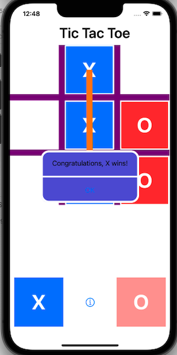
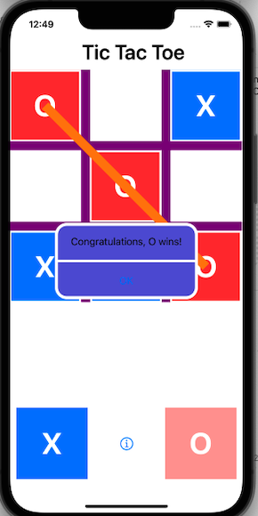
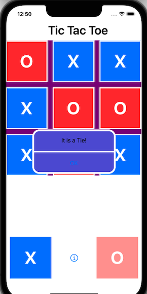

# Tic Tac Toe

* Name:             Hengkuan Lu
* UChicago Email:   hklu21@uchicago.edu
* Slack Username:   Hengkuan Lu

## Introduction

This is an game app called [Tic Tac Toe](https://en.wikipedia.org/wiki/Tic-tac-toe).

## Rules and Settings

The turn always starts from X. In each turn the player (X or O) touch and drag its own piece to the grid place the new piece to the grid. The piece can only be placed in the non-occupied grids. The target grid to place is the one in the non-occupied grids that intersects most with the piece at the end of the moving. If the piece does not intersect any available grid, the piece is not placed and the turn does not change. 

Everytime after a successful turn, the grid would check the state of the game, to determine whether the game is ended. If the game ends, declare the winner or a tie. (One can see these information in the info view come out when the game ends as shown below, and can click the "OK" button to clear the grid and restart the game)

## Samples

     

## Resources and Attributions
[Drawing grid on UIView](https://stackoverflow.com/questions/46390838/drawing-a-grid-on-a-uiview-in-swift)

[Set cornerRadius for specified corner](https://stackoverflow.com/questions/10167266/how-to-set-cornerradius-for-only-top-left-and-top-right-corner-of-a-uiview)

[View layers setting](https://stackoverflow.com/questions/38780743/how-can-i-bring-a-view-in-front-of-another-view-in-swift)

[Detecting PanGesture End](https://stackoverflow.com/questions/6467638/detecting-pan-gesture-end)

[Sort Dict by value](https://programmingwithswift.com/how-to-sort-a-dictionary-by-value-with-swift/)

[Set in Swift](https://developer.apple.com/documentation/swift/set)

[Draw line animated](https://stackoverflow.com/questions/42978418/draw-line-animated)

[Set animation delay](https://developer.apple.com/documentation/uikit/uiview/1622472-setanimationdelay)

